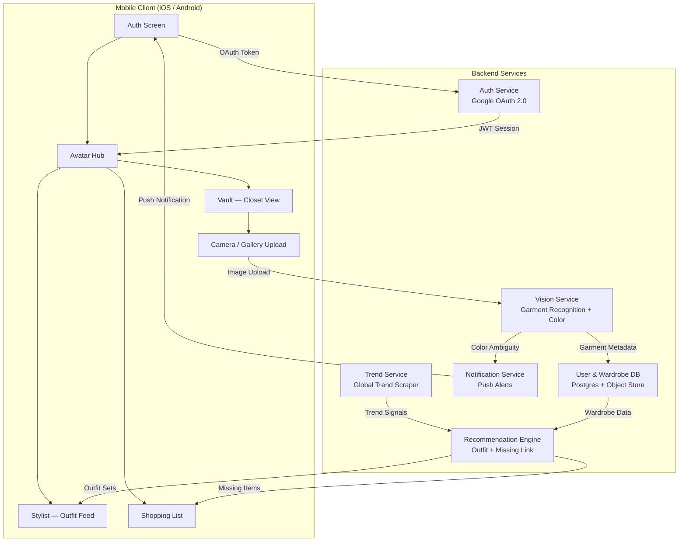
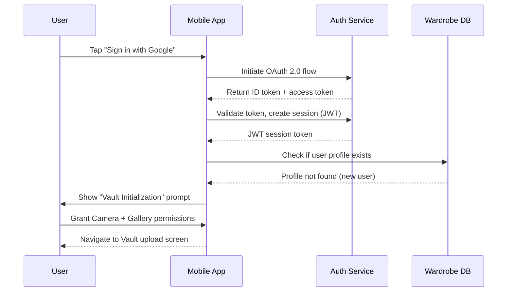
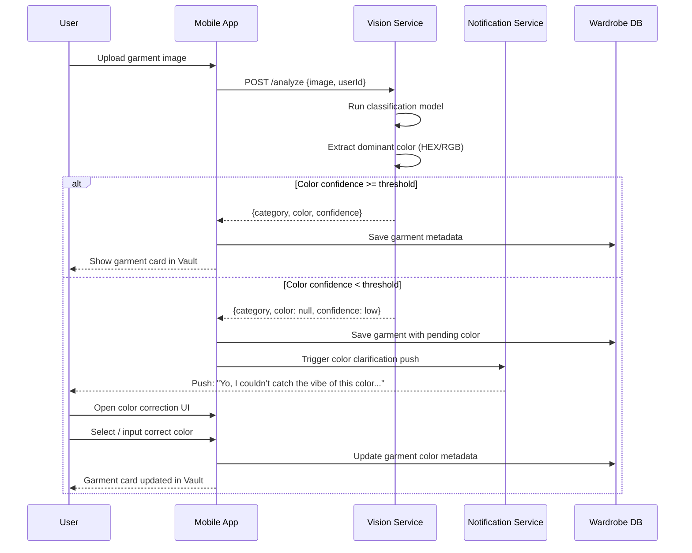
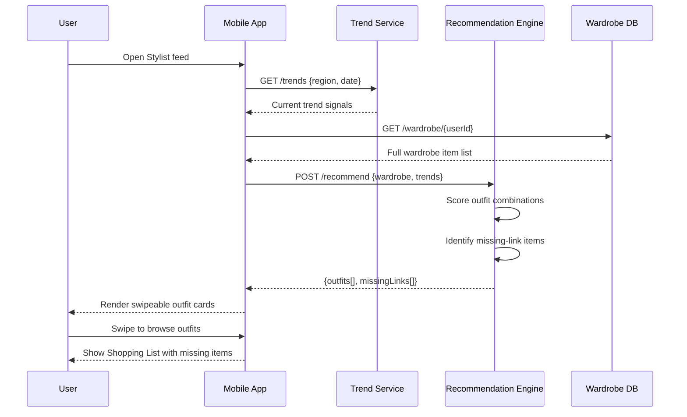

# Design Document: Project GRail — AI Personal Stylist

## Overview

Project GRail is a mobile-first AI personal stylist application that digitizes a user's wardrobe through computer vision, categorizes garments automatically, and generates "God-tier" outfit recommendations driven by real-time global trend data. The system combines a vision inference engine for clothing recognition and color extraction, a trend-sync layer that scrapes social/fashion signals, and a recommendation engine that matches existing wardrobe items — or surfaces the single missing piece that unlocks the most new combinations.

The app is built around three core loops: **Vault** (closet digitization), **Sync** (trend ingestion), and **Style** (outfit generation). Authentication is handled via Google OAuth 2.0, and the UI follows a Glassmorphism/Neomorphism design language with Tinder-style swipe micro-interactions for outfit browsing.

The architecture is designed to be mobile-native (iOS/Android) with a cloud backend handling vision inference, trend scraping, and recommendation computation — keeping the client lightweight and the heavy lifting server-side.

---

## Architecture



---

## Sequence Diagrams

### Flow 1: New User Onboarding & Vault Initialization



### Flow 2: Garment Upload & Vision Processing



### Flow 3: Outfit Recommendation & Missing Link



---

## Components and Interfaces

### Component 1: Auth Service

**Purpose**: Handles Google OAuth 2.0 login, session token issuance, and user profile bootstrapping.

**Interface**:
```pascal
INTERFACE AuthService
  PROCEDURE initiateOAuth() → OAuthRedirectURL
  PROCEDURE validateToken(idToken: String) → SessionToken
  PROCEDURE refreshSession(refreshToken: String) → SessionToken
  PROCEDURE revokeSession(sessionToken: String) → Void
END INTERFACE
```

**Responsibilities**:
- Validate Google ID tokens against Google's public keys
- Issue signed JWT session tokens with expiry
- Create new user profiles on first login
- Revoke sessions on logout

---

### Component 2: Vision Service

**Purpose**: Accepts garment images, runs classification and color extraction, returns structured metadata.

**Interface**:
```pascal
INTERFACE VisionService
  PROCEDURE analyzeGarment(image: ImageBlob, userId: UUID) → GarmentAnalysisResult
  PROCEDURE correctColor(garmentId: UUID, color: ColorInput) → GarmentMetadata
END INTERFACE
```

**Responsibilities**:
- Run garment category classification (Upper Torso / Lower Body + sub-type)
- Extract dominant HEX/RGB color with confidence score
- Flag low-confidence color results for user correction
- Trigger push notification pipeline on ambiguous color

---

### Component 3: Trend Service

**Purpose**: Ingests and normalizes global fashion trend signals from social media and fashion APIs.

**Interface**:
```pascal
INTERFACE TrendService
  PROCEDURE fetchTrends(region: String, date: Date) → TrendSignalList
  PROCEDURE getTrendScore(category: String, colorHex: String) → Float
END INTERFACE
```

**Responsibilities**:
- Scrape / poll fashion trend sources on a scheduled cadence
- Normalize trend data into scored category+color signals
- Cache trend data with TTL to avoid redundant fetches

---

### Component 4: Recommendation Engine

**Purpose**: Combines wardrobe data and trend signals to generate ranked outfit sets and missing-link suggestions.

**Interface**:
```pascal
INTERFACE RecommendationEngine
  PROCEDURE generateOutfits(wardrobe: WardrobeItem[], trends: TrendSignal[]) → OutfitSet[]
  PROCEDURE findMissingLinks(wardrobe: WardrobeItem[], trends: TrendSignal[]) → MissingLinkItem[]
END INTERFACE
```

**Responsibilities**:
- Score all valid upper+lower body combinations against trend signals
- Rank outfit sets by trend alignment and color harmony
- Identify wardrobe gaps — single items that would unlock the most new combinations
- Return ranked shopping list of missing items

---

### Component 5: Notification Service

**Purpose**: Delivers push notifications for color clarification and other async user prompts.

**Interface**:
```pascal
INTERFACE NotificationService
  PROCEDURE sendColorClarification(userId: UUID, garmentId: UUID) → Void
  PROCEDURE sendOutfitReady(userId: UUID, outfitId: UUID) → Void
END INTERFACE
```

**Responsibilities**:
- Integrate with FCM (Firebase Cloud Messaging) for cross-platform push delivery
- Track notification delivery status
- Deep-link notifications back to the relevant in-app screen

---

## Data Models

### Model: User

```pascal
STRUCTURE User
  id:            UUID
  googleId:      String
  email:         String
  displayName:   String
  avatarUrl:     String
  createdAt:     Timestamp
  lastLoginAt:   Timestamp
  vaultReady:    Boolean       // true once first garment uploaded
END STRUCTURE
```

**Validation Rules**:
- `email` must be a valid email format
- `googleId` must be unique across all users
- `vaultReady` defaults to false on creation

---

### Model: GarmentItem

```pascal
STRUCTURE GarmentItem
  id:            UUID
  userId:        UUID
  imageUrl:      String        // object store URL
  category:      GarmentCategory
  subCategory:   String        // e.g. "Jeans", "Jacket"
  colorHex:      String        // e.g. "#1A2B3C"
  colorName:     String        // e.g. "Midnight Navy"
  colorPending:  Boolean       // true if awaiting user correction
  confidence:    Float         // vision model confidence 0.0–1.0
  uploadedAt:    Timestamp
  updatedAt:     Timestamp
END STRUCTURE

ENUM GarmentCategory
  UPPER_TORSO
  LOWER_BODY
END ENUM
```

**Validation Rules**:
- `colorHex` must match pattern `#[0-9A-Fa-f]{6}`
- `confidence` must be in range [0.0, 1.0]
- `category` must be a valid GarmentCategory value

---

### Model: OutfitSet

```pascal
STRUCTURE OutfitSet
  id:            UUID
  userId:        UUID
  upperItem:     GarmentItem
  lowerItem:     GarmentItem
  trendScore:    Float         // 0.0–1.0 alignment with current trends
  harmonyScore:  Float         // 0.0–1.0 color harmony score
  totalScore:    Float         // weighted composite score
  generatedAt:   Timestamp
END STRUCTURE
```

---

### Model: MissingLinkItem

```pascal
STRUCTURE MissingLinkItem
  id:            UUID
  userId:        UUID
  suggestedItem: String        // e.g. "Tan Chinos"
  category:      GarmentCategory
  colorHex:      String
  unlockCount:   Integer       // number of new outfits this item would enable
  trendScore:    Float
  generatedAt:   Timestamp
END STRUCTURE
```

---

### Model: TrendSignal

```pascal
STRUCTURE TrendSignal
  id:            UUID
  category:      String        // e.g. "Lower Body - Trousers"
  colorHex:      String
  colorName:     String
  score:         Float         // 0.0–1.0 trend strength
  source:        String        // e.g. "Instagram", "Vogue API"
  capturedAt:    Timestamp
END STRUCTURE
```

---

## Algorithmic Pseudocode

### Algorithm 1: Garment Analysis Pipeline

```pascal
ALGORITHM analyzeGarment(image, userId)
  INPUT:  image of type ImageBlob, userId of type UUID
  OUTPUT: result of type GarmentAnalysisResult

  BEGIN
    ASSERT image IS NOT NULL
    ASSERT image.sizeBytes <= MAX_IMAGE_SIZE

    // Step 1: Run classification model
    classificationResult ← runClassificationModel(image)
    ASSERT classificationResult IS NOT NULL

    category    ← classificationResult.category
    subCategory ← classificationResult.subCategory
    confidence  ← classificationResult.confidence

    // Step 2: Extract dominant color
    colorResult ← extractDominantColor(image)
    colorHex    ← colorResult.hex
    colorConf   ← colorResult.confidence

    // Step 3: Evaluate color confidence
    IF colorConf >= COLOR_CONFIDENCE_THRESHOLD THEN
      colorPending ← false
    ELSE
      colorPending ← true
      triggerColorClarificationNotification(userId, garmentId)
    END IF

    // Step 4: Persist garment metadata
    garment ← GarmentItem {
      id:           generateUUID(),
      userId:       userId,
      imageUrl:     storeImage(image),
      category:     category,
      subCategory:  subCategory,
      colorHex:     colorHex,
      colorPending: colorPending,
      confidence:   confidence,
      uploadedAt:   now()
    }

    DB.save(garment)

    ASSERT DB.exists(garment.id)

    RETURN GarmentAnalysisResult {
      garment:      garment,
      colorPending: colorPending
    }
  END
END ALGORITHM
```

**Preconditions**:
- `image` is non-null and within size limits
- Classification model and color extraction service are available
- User identified by `userId` exists in the database

**Postconditions**:
- Garment record persisted to DB with valid metadata
- If color confidence is low, a push notification is queued
- Returns result with `colorPending` flag indicating correction needed

**Loop Invariants**: N/A (no loops in this algorithm)

---

### Algorithm 2: Outfit Recommendation Generation

```pascal
ALGORITHM generateOutfits(wardrobe, trends)
  INPUT:  wardrobe of type WardrobeItem[], trends of type TrendSignal[]
  OUTPUT: rankedOutfits of type OutfitSet[]

  BEGIN
    ASSERT wardrobe IS NOT NULL AND wardrobe.length > 0
    ASSERT trends IS NOT NULL

    upperItems ← FILTER wardrobe WHERE item.category = UPPER_TORSO
    lowerItems ← FILTER wardrobe WHERE item.category = LOWER_BODY

    ASSERT upperItems.length > 0
    ASSERT lowerItems.length > 0

    outfits ← empty list

    // Step 1: Generate all valid combinations
    FOR each upper IN upperItems DO
      FOR each lower IN lowerItems DO
        ASSERT upper.colorHex IS NOT NULL AND NOT upper.colorPending
        ASSERT lower.colorHex IS NOT NULL AND NOT lower.colorPending

        trendScore   ← computeTrendScore(upper, lower, trends)
        harmonyScore ← computeColorHarmony(upper.colorHex, lower.colorHex)
        totalScore   ← (trendScore * TREND_WEIGHT) + (harmonyScore * HARMONY_WEIGHT)

        outfit ← OutfitSet {
          id:           generateUUID(),
          upperItem:    upper,
          lowerItem:    lower,
          trendScore:   trendScore,
          harmonyScore: harmonyScore,
          totalScore:   totalScore,
          generatedAt:  now()
        }

        outfits.append(outfit)

        // Loop invariant: all outfits appended so far have valid scores
        ASSERT ALL o IN outfits: o.totalScore >= 0.0 AND o.totalScore <= 1.0
      END FOR
    END FOR

    // Step 2: Sort by total score descending
    rankedOutfits ← SORT outfits BY totalScore DESCENDING

    ASSERT rankedOutfits.length = upperItems.length * lowerItems.length

    RETURN rankedOutfits
  END
END ALGORITHM
```

**Preconditions**:
- `wardrobe` contains at least one upper and one lower body item
- All items used have resolved (non-pending) color metadata
- `trends` list is non-null (may be empty — results in trend-score of 0)

**Postconditions**:
- Returns all valid upper+lower combinations, ranked by composite score
- Every outfit in the result has `totalScore` in [0.0, 1.0]
- Result length equals `upperItems.length × lowerItems.length`

**Loop Invariants**:
- Inner loop: all outfits appended so far have valid, bounded scores
- Outer loop: all upper items processed so far have been paired with every lower item

---

### Algorithm 3: Missing Link Detection

```pascal
ALGORITHM findMissingLinks(wardrobe, trends)
  INPUT:  wardrobe of type WardrobeItem[], trends of type TrendSignal[]
  OUTPUT: missingLinks of type MissingLinkItem[]

  BEGIN
    ASSERT wardrobe IS NOT NULL

    // Step 1: Identify trending items NOT in wardrobe
    trendingItems ← FILTER trends WHERE score >= TREND_THRESHOLD

    candidateGaps ← empty list

    FOR each trend IN trendingItems DO
      matchFound ← false

      FOR each item IN wardrobe DO
        IF item.category = trend.category AND
           colorDistance(item.colorHex, trend.colorHex) <= COLOR_MATCH_TOLERANCE THEN
          matchFound ← true
          BREAK
        END IF
      END FOR

      IF NOT matchFound THEN
        candidateGaps.append(trend)
      END IF

      // Loop invariant: candidateGaps contains only trends with no wardrobe match so far
    END FOR

    // Step 2: Score each gap by how many new outfits it would unlock
    missingLinks ← empty list

    FOR each gap IN candidateGaps DO
      unlockCount ← computeUnlockCount(gap, wardrobe)

      IF unlockCount >= MIN_UNLOCK_THRESHOLD THEN
        missingLink ← MissingLinkItem {
          id:            generateUUID(),
          suggestedItem: gap.colorName + " " + gap.category,
          category:      gap.category,
          colorHex:      gap.colorHex,
          unlockCount:   unlockCount,
          trendScore:    gap.score,
          generatedAt:   now()
        }
        missingLinks.append(missingLink)
      END IF
    END FOR

    // Step 3: Sort by unlock count descending
    missingLinks ← SORT missingLinks BY unlockCount DESCENDING

    RETURN missingLinks
  END
END ALGORITHM
```

**Preconditions**:
- `wardrobe` is non-null (may be empty for new users)
- `trends` is non-null

**Postconditions**:
- Returns items sorted by `unlockCount` descending
- Every returned item has `unlockCount >= MIN_UNLOCK_THRESHOLD`
- No returned item has a color/category match already present in the wardrobe

**Loop Invariants**:
- Gap detection loop: `candidateGaps` contains only trends with no wardrobe match confirmed so far
- Scoring loop: all `missingLinks` appended so far meet the minimum unlock threshold

---

### Algorithm 4: Color Harmony Scoring

```pascal
ALGORITHM computeColorHarmony(hexA, hexB)
  INPUT:  hexA of type String (HEX color), hexB of type String (HEX color)
  OUTPUT: score of type Float (0.0 – 1.0)

  BEGIN
    ASSERT hexA matches pattern "#[0-9A-Fa-f]{6}"
    ASSERT hexB matches pattern "#[0-9A-Fa-f]{6}"

    // Convert HEX to HSL
    hslA ← hexToHSL(hexA)
    hslB ← hexToHSL(hexB)

    hueDiff        ← ABS(hslA.hue - hslB.hue)
    satDiff        ← ABS(hslA.saturation - hslB.saturation)
    lightDiff      ← ABS(hslA.lightness - hslB.lightness)

    // Complementary colors (hue diff ~180) score highest
    // Analogous colors (hue diff < 30) score high
    // Clashing colors (hue diff 90–150) score low

    IF hueDiff >= 150 AND hueDiff <= 210 THEN
      hueScore ← 1.0   // complementary
    ELSE IF hueDiff <= 30 OR hueDiff >= 330 THEN
      hueScore ← 0.85  // analogous
    ELSE IF hueDiff >= 90 AND hueDiff <= 150 THEN
      hueScore ← 0.3   // clashing
    ELSE
      hueScore ← 0.6   // neutral
    END IF

    // Penalize extreme lightness similarity (both very dark or very light)
    IF lightDiff < 10 AND hslA.lightness < 20 THEN
      lightPenalty ← 0.2
    ELSE IF lightDiff < 10 AND hslA.lightness > 80 THEN
      lightPenalty ← 0.15
    ELSE
      lightPenalty ← 0.0
    END IF

    score ← CLAMP(hueScore - lightPenalty, 0.0, 1.0)

    ASSERT score >= 0.0 AND score <= 1.0

    RETURN score
  END
END ALGORITHM
```

**Preconditions**:
- Both inputs are valid 6-digit HEX color strings
- `hexToHSL` conversion function is available

**Postconditions**:
- Returns a Float in [0.0, 1.0]
- Complementary color pairs score >= 0.9
- Clashing pairs score <= 0.4

**Loop Invariants**: N/A

---

## Key Functions with Formal Specifications

### Function: validateGarmentImage()

```pascal
PROCEDURE validateGarmentImage(image: ImageBlob) → Boolean
```

**Preconditions**:
- `image` parameter is provided (may be null)

**Postconditions**:
- Returns `true` if and only if: image is non-null, size <= MAX_IMAGE_SIZE, and MIME type is in [image/jpeg, image/png, image/webp]
- Returns `false` otherwise
- No mutations to input

---

### Function: computeTrendScore()

```pascal
PROCEDURE computeTrendScore(upper: GarmentItem, lower: GarmentItem, trends: TrendSignal[]) → Float
```

**Preconditions**:
- `upper.category = UPPER_TORSO`
- `lower.category = LOWER_BODY`
- Both items have non-pending, valid `colorHex` values

**Postconditions**:
- Returns Float in [0.0, 1.0]
- Score is higher when item colors/categories closely match high-scoring trend signals
- Returns 0.0 if `trends` is empty

---

### Function: computeUnlockCount()

```pascal
PROCEDURE computeUnlockCount(gap: TrendSignal, wardrobe: WardrobeItem[]) → Integer
```

**Preconditions**:
- `gap` is a valid TrendSignal with non-null category and colorHex
- `wardrobe` is non-null

**Postconditions**:
- Returns the count of new valid outfit combinations the gap item would enable
- Returns 0 if wardrobe is empty or no complementary items exist
- Does not mutate wardrobe

---

## Example Usage

```pascal
// --- Example 1: New user uploads first garment ---
SEQUENCE
  image       ← Camera.capture()
  isValid     ← validateGarmentImage(image)

  IF NOT isValid THEN
    DISPLAY "Image format not supported. Try again."
    RETURN
  END IF

  result ← VisionService.analyzeGarment(image, currentUser.id)

  IF result.colorPending THEN
    DISPLAY "Garment saved! We'll ping you to confirm the color."
  ELSE
    DISPLAY "Added to your Vault: " + result.garment.subCategory
  END IF
END SEQUENCE

// --- Example 2: Generate outfit feed ---
SEQUENCE
  wardrobe ← DB.getWardrobe(currentUser.id)
  trends   ← TrendService.fetchTrends(currentUser.region, today())
  outfits  ← RecommendationEngine.generateOutfits(wardrobe, trends)

  IF outfits.length = 0 THEN
    DISPLAY "Add more items to your Vault to unlock outfit suggestions."
  ELSE
    FOR each outfit IN outfits DO
      renderOutfitCard(outfit)
    END FOR
  END IF
END SEQUENCE

// --- Example 3: Shopping list / missing link ---
SEQUENCE
  wardrobe     ← DB.getWardrobe(currentUser.id)
  trends       ← TrendService.fetchTrends(currentUser.region, today())
  missingLinks ← RecommendationEngine.findMissingLinks(wardrobe, trends)

  DISPLAY "One item that unlocks the most looks:"
  topItem ← missingLinks[0]
  DISPLAY topItem.suggestedItem + " unlocks " + topItem.unlockCount + " new outfits"
END SEQUENCE

// --- Example 4: User corrects garment color ---
SEQUENCE
  garmentId   ← notification.deepLinkGarmentId
  userInput   ← ColorPicker.show("Midnight Navy", "Charcoal", "Other")
  colorInput  ← ColorInput { name: userInput.name, hex: userInput.hex }

  updated ← VisionService.correctColor(garmentId, colorInput)
  DISPLAY "Color updated: " + updated.colorName
END SEQUENCE
```

---

## Correctness Properties

*A property is a characteristic or behavior that should hold true across all valid executions of a system — essentially, a formal statement about what the system should do. Properties serve as the bridge between human-readable specifications and machine-verifiable correctness guarantees.*

### Property 1: Garment Color Invariant

*For any* GarmentItem saved to the Vault, either `colorHex` matches the pattern `#[0-9A-Fa-f]{6}` or `colorPending` is `true` — never neither.

**Validates: Requirements 2.7**

---

### Property 2: Outfit Category Pairing Invariant

*For any* OutfitSet generated by the Recommendation Engine, `upperItem.category` is always `UPPER_TORSO` and `lowerItem.category` is always `LOWER_BODY`.

**Validates: Requirements 4.2**

---

### Property 3: Outfit Score Bounds

*For any* wardrobe and trend signal inputs, every OutfitSet produced by `generateOutfits` has a `totalScore` in the range [0.0, 1.0].

**Validates: Requirements 4.3, 4.4**

---

### Property 4: Outfit Count Equals Cartesian Product

*For any* wardrobe with N resolved UPPER_TORSO items and M resolved LOWER_BODY items, `generateOutfits` returns exactly N × M OutfitSets.

**Validates: Requirements 4.2**

---

### Property 5: Missing Link Threshold Invariant

*For any* wardrobe and trend inputs, every MissingLinkItem returned by `findMissingLinks` has `unlockCount >= MIN_UNLOCK_THRESHOLD`.

**Validates: Requirements 6.2**

---

### Property 6: Missing Link No-Duplicate Invariant

*For any* wardrobe and trend inputs, no MissingLinkItem returned by `findMissingLinks` has a category and color that already exists in the wardrobe within `COLOR_MATCH_TOLERANCE`.

**Validates: Requirements 6.3**

---

### Property 7: Color Harmony Score Bounds

*For any* pair of valid HEX color strings, `computeColorHarmony` returns a Float in [0.0, 1.0].

**Validates: Requirements 5.2**

---

### Property 8: Vault Initialization Prompt Invariant

*For any* user `u` where `u.vaultReady = false`, the Vault Initialization prompt is displayed on first login and the Stylist feed is not shown.

**Validates: Requirements 10.1, 10.4**

---

### Property 9: Authentication Enforcement Invariant

*For any* API request to a non-`/auth/*` endpoint without a valid, non-expired JWT, the Auth_Service returns a 401 response.

**Validates: Requirements 1.6, 9.5**

---

### Property 10: Color Correction Clears Pending Flag

*For any* GarmentItem with `colorPending = true`, after a successful `correctColor` call with a valid HEX input, `colorPending` is `false`.

**Validates: Requirements 3.3**

---

### Property 11: Wardrobe Data Isolation

*For any* two distinct users, a wardrobe query for one user never returns GarmentItems belonging to the other user.

**Validates: Requirements 9.2**

---

### Property 12: Color Input Sanitization

*For any* color correction input, only values matching `#[0-9A-Fa-f]{6}` are accepted and written to the database; all other inputs are rejected.

**Validates: Requirements 9.4**

---

## Error Handling

### Error Scenario 1: Vision Model Unavailable

**Condition**: Vision Service returns a 5xx error or times out during garment analysis
**Response**: Return a user-friendly error ("Our style AI is taking a quick break — try again in a moment"), queue the image for retry
**Recovery**: Exponential backoff retry (3 attempts); if all fail, notify user via push to re-upload

### Error Scenario 2: Low Color Confidence

**Condition**: Color extraction confidence falls below `COLOR_CONFIDENCE_THRESHOLD`
**Response**: Save garment with `colorPending = true`, send push notification with color clarification prompt
**Recovery**: User selects correct color via in-app UI; metadata updated immediately; garment becomes eligible for outfit generation

### Error Scenario 3: OAuth Token Failure

**Condition**: Google ID token validation fails (expired, tampered, or revoked)
**Response**: Return 401, clear local session, redirect user to login screen
**Recovery**: User re-authenticates via Google OAuth flow

### Error Scenario 4: Empty Wardrobe on Outfit Generation

**Condition**: User requests outfit feed but has no items in one or both categories (upper/lower)
**Response**: Show contextual empty state: "Add at least one top and one bottom to unlock your first look"
**Recovery**: Deep-link to Vault upload screen

### Error Scenario 5: Trend Service Unavailable

**Condition**: Trend Service fails to return data within timeout
**Response**: Fall back to cached trend signals (last successful fetch); if no cache exists, generate outfits using color harmony only (trend score = 0)
**Recovery**: Retry trend fetch on next app foreground event; display subtle "Trends may be outdated" indicator

---

## Testing Strategy

### Unit Testing Approach

Each service function is tested in isolation with mocked dependencies:
- `analyzeGarment`: mock vision model responses (high confidence, low confidence, null)
- `generateOutfits`: test with various wardrobe sizes (0 items, 1 item per category, large wardrobes)
- `findMissingLinks`: verify unlock count computation and threshold filtering
- `computeColorHarmony`: test all hue relationship buckets (complementary, analogous, clashing, neutral)
- `validateGarmentImage`: test valid formats, oversized files, null input

### Property-Based Testing Approach

**Property Test Library**: fast-check

Key properties to verify:
- `computeColorHarmony(a, b)` always returns a value in [0.0, 1.0] for any valid HEX pair
- `generateOutfits(wardrobe, trends)` result length always equals `upperCount × lowerCount`
- `findMissingLinks` never returns an item whose category+color already exists in the wardrobe within tolerance
- Outfit scores are always bounded: `totalScore = (trendScore × TREND_WEIGHT) + (harmonyScore × HARMONY_WEIGHT)` stays in [0.0, 1.0]
- Color correction: after `correctColor(id, input)`, the garment's `colorPending` is always `false`

### Integration Testing Approach

- End-to-end upload flow: image → Vision Service → DB → Vault UI
- Outfit generation pipeline: wardrobe + trends → Recommendation Engine → ranked outfit list
- Auth flow: Google OAuth → JWT issuance → protected endpoint access
- Push notification delivery: low-confidence color → notification queued → deep-link opens correction UI

---

## Performance Considerations

- Vision inference should complete within 3 seconds for a standard garment image; images are resized client-side to max 1024px before upload to reduce payload
- Outfit generation is O(n×m) where n = upper items, m = lower items; for wardrobes up to 200 items per category this is acceptable synchronously; beyond that, pre-compute and cache outfit sets on wardrobe change events
- Trend data is cached server-side with a 6-hour TTL; clients receive a lightweight diff payload rather than the full trend list on subsequent fetches
- Missing link computation is triggered asynchronously after wardrobe updates, not on every feed open

---

## Security Considerations

- All API endpoints require a valid JWT (RS256 signed) except `/auth/google/callback`
- Images are stored in a private object store bucket; access is via short-lived signed URLs (15-minute expiry)
- Google OAuth tokens are validated server-side against Google's JWKS endpoint — never trusted client-side only
- User wardrobe data is scoped strictly by `userId`; all DB queries include `WHERE userId = :currentUserId` to prevent cross-user data leakage
- Push notification payloads contain only `garmentId` and action type — no PII in the notification body
- Color correction input is sanitized and validated against the HEX pattern before DB write

---

## Dependencies

| Dependency | Purpose |
|---|---|
| Google OAuth 2.0 | User authentication |
| Vision/ML Model (TensorFlow Lite or custom API) | Garment classification + color extraction |
| Firebase Cloud Messaging (FCM) | Cross-platform push notifications |
| PostgreSQL | Primary relational data store (users, garments, outfits) |
| Object Storage (S3-compatible) | Garment image storage |
| Trend Data Source (fashion/social API or scraper) | Global trend signal ingestion |
| fast-check | Property-based testing |
| Mermaid | Architecture and sequence diagram rendering |
